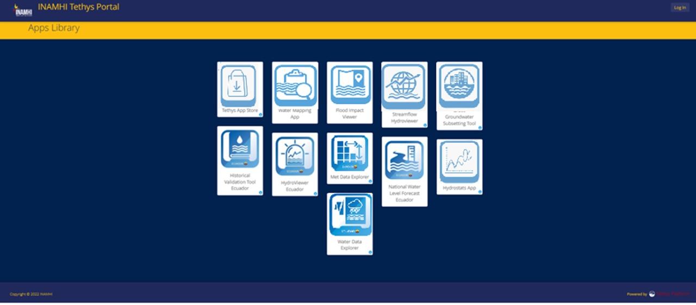

.. _Tethys-logos:

.. |logo1| image:: _static/imgs/Tethys/hvt.png
    :width: 30

MANUAL DE USUARIOS DE LA PLATAFORMA TETHYS-INAMHI-ECUADOR
############################################################

Este website contiene una guía para el manejo de las aplicaciones contenidas en la plataforma Tethys del INAMHI (Instituto
Nacional de Meteorología e Hidrología).
Tethys fue probada mediante la implementación de portales web para socios de la iniciativa de sostenibilidad del agua del
Grupo de Observaciones de la Tierra (GEO) y de la Universidad Brigham Young University (BYU).
En Ecuador, la implementación y personalización de la plataforma Tethys ha sido posible con la colaboración del
INAMHI, Fundación EcoCiencia y el Centro Internacional de Agricultura Tropical (CIAT), mediante el programa SERVIR-Amazonia.

Caja de herramientas GEOGloWS
********************************

La caja de herramientas GEOGloWS es una colección de herramientas de aplicación web de apoyo a la toma de decisiones en
materia de recursos hídricos. Se basa en lo que se está organizando en GEOGloWS como un **Almacén de Aplicaciones** que
se puede considerar similar a las tiendas de aplicaciones de Apple o tiendas de aplicaciones Android. Estas aplicaciones
fundamentales se extraen del almacén de aplicaciones que crecerá con el tiempo, las cuales pueden descargarse y combinarse
en portales personalizados con aplicaciones personalizadas para satisfacer las necesidades específicas de los diferentes
partes interesadas.

Plataforma Tethys INAMHI
*************************

La plataforma Tethys alberga aplicaciones para pronóstico hidrológico, meteorológico, visualización y descarga de datos
relacionadas a variables hidrometeorológicas.

    1. **Aplicaciones para pronóstico hidrológico:** GEOGloWS ECMWF Streamflow Hydroviewer, Hydroviewer Ecuador,
                                                     Historical Validation Tool, National Water Level Forecast.
    2. **Aplicaciones para pronóstico meteorológico:** Met Data Explorer
    3. **Aplicación para visualización de datos:** Water Data Explorer

A continuación, se describe brevemente cada una de las aplicaciones contenidas en la plataforma Tethys de INAMHI.

:doc:`GEOGloWS HydroViewer </content/AplicacionesHidrologicas>` |logo1|
    The GEOGloWS ECMWF Streamflow Services provides access to a 40-year simulation and
    daily 15-day ensemble forecast on nearly 1,000,000 river reaches globally.

:doc:`HydroViewer-Ecuador </content/hydroviewer-ecuador>`

:doc:`Historical Validation Tool </content/historical-validation>`

:doc:`National Water Level Forecast </content/national-water-level-forecast>`

:doc:`Water Data Explorer </content/water-data-explorer>`
    This web app is used by the WMO as a catalog, data access, and visualization for observational and other time series
    hydrological data stored at point locations.

:doc:`Met Data Explorer </content/met-data-explorer>`
    Similar to the Water Data Explorer, this app is used to process multi-dimensional gridded data typical of meteorological
    forecasting systems that produce output in a time series stack of rasters formatted in netCDF, Grib, and geoTIFF. This
    could be any type of data, but most often are used in GEOGloWS for precipitation.

:doc:`GRACE Groundwater </content/groundwater-tools>`
    The GRACE satellite data have become useful to understand groundwater anomalies. This application (still being updated)
    provides visualization and access to this information.
.. image:: _static/imgs/Tethys/grace.png
   :width: 20%

:doc:`HydroStats </content/streamflow-model/hydrostats>`
    This application is used for validation of the GEOGloWS streamflow historical and forecasts as you will see in those
    sections, but it is a general purpose tool to perform a goodness of fit between observed and modeled (or any two) time
    series.

:doc:`Tendencias de Clima </content/streamflow-model/tendencias-clima>`
    This application is used for validation of the GEOGloWS streamflow historical and forecasts as you will see in those
    sections, but it is a general purpose tool to perform a goodness of fit between observed and modeled (or any two) time
    series.

:doc:`Reservorios </content/streamflow-model/AplicacionesHidrologicas>`
    This application is used for validation of the GEOGloWS streamflow historical and forecasts as you will see in those
    sections, but it is a general purpose tool to perform a goodness of fit between observed and modeled (or any two) time
    series.

:doc:`Water Mapping App</content/streamflow-model/historical-WaterMappingApp>`
    This application is used for validation of the GEOGloWS streamflow historical and forecasts as you will see in those
    sections, but it is a general purpose tool to perform a goodness of fit between observed and modeled (or any two) time
    series.

:doc:`Flood Impact Viewer </content/streamflow-model/historical-floodImpactViewer>`
    This application is used for validation of the GEOGloWS streamflow historical and forecasts as you will see in those
    sections, but it is a general purpose tool to perform a goodness of fit between observed and modeled (or any two) time
    series.

.. note:: **Páginas de Interés**

             Página de INAMHI:
            `INAMHI <https://www.inamhi.gob.ec/>`_
            Página de SERVIR-Amazonia:
            `SERVIR-Amazonia <https://servir.ciat.cgiar.org/?lang=es>`_
            Página de Fundación EcoCiencia:
            `Fundacion EcoCiencia <https://ecociencia.org/>`_
            Página de Laboratorio de Hydroinformática Brigham Young University:
            `Video BYU <https://hydroinformatics.byu.edu/>`_
            Video de Brigham Young University-GEOGloWS:
            `Video BYU <https://youtu.be/PLG8U8AQmXY>`_

.. toctree::
   :maxdepth: 1
   :caption: Contents:

   content/AplicacionesHidrologicas
   content/hydroviewer-ecuador
   content/historical-validation
   content/national-water-level
   content/water-data-explorer
   content/met-data-explorer

Indice
==================

* :ref:`genindex`
* :ref:`modindex`
* :ref:`search`

.. _link-to-geoglows-model-page

.. rst shortcut to make a link